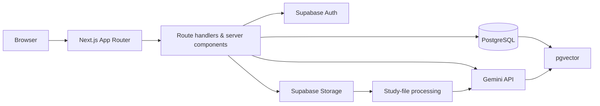
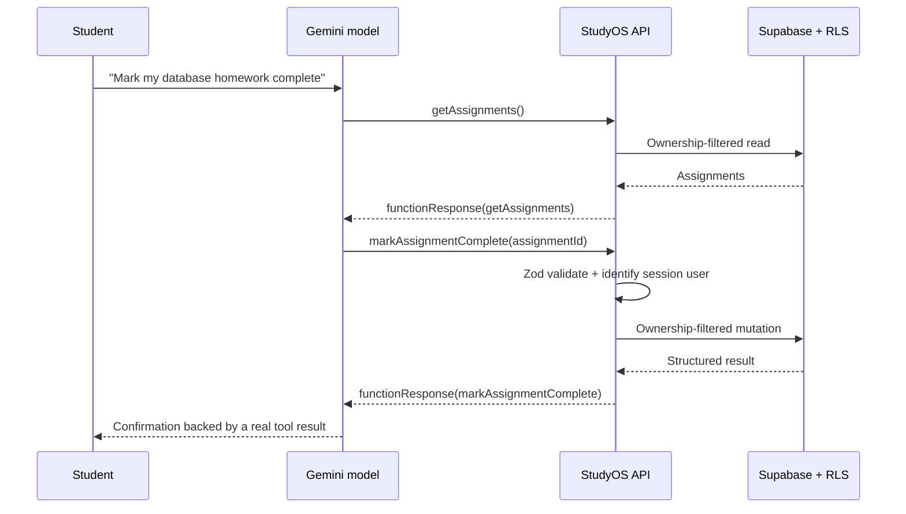

# StudyOS

StudyOS is an AI-powered academic workspace for university students. It brings course organization, deadline planning, private course files, grounded question-answering, flashcard generation, and controlled task automation into one Next.js application.

It is designed as a full-stack / AI engineering portfolio project: the UI is intentionally polished, while the underlying implementation demonstrates database modeling, Supabase security, document ingestion, pgvector retrieval, streaming, structured outputs, tools, evaluation, and observability.


## Overview

Students frequently switch between an LMS, a calendar, random PDFs, and a chatbot with no context. StudyOS gives coursework one private home. Documents become a searchable knowledge base; assignments inform a study plan; and the assistant answers with citations rather than pretending it knows what is in a lecture.

## Features

- Email/password signup, login, logout, session refresh, and protected routes via Supabase Auth.
- Course CRUD with detail views for related work, documents, chats, and flashcard sets.
- Assignment CRUD, priority, workload estimates, completion/reopen controls, deadline visibility, and dashboard summaries.
- Private uploads for PDFs, Word documents, PowerPoint presentations, spreadsheets, CSV, text, and Markdown with MIME/size validation, processing states, text extraction, chunking, and embeddings.
- Real RAG chat: question embedding → ownership-filtered pgvector search → untrusted context envelope → streaming answer → source citations.
- A task assistant that uses constrained backend tools to list work, create/update assignments, complete assignments, search documents, and create a basic plan.
- Schema-validated flashcard and study-plan generation with Zod validation before data is persisted.
- User-private AI observability: request count, success/failure count, latency, and feature breakdown.
- A 17-case evaluation harness that runs against the live model: retrieval accuracy, concept coverage, refusal on unsupported questions, and multi-turn tool routing.

## Tech Stack

| Area | Choice |
| --- | --- |
| Web app | Next.js App Router, React 19, TypeScript (strict) |
| UI | Tailwind CSS, Lucide icons, responsive server/client components |
| Auth/data/storage | Supabase Auth, PostgreSQL, Supabase Storage, Row Level Security |
| Retrieval | Gemini embeddings, `pgvector`, Supabase RPC similarity search |
| AI | Gemini streaming generation, function tools, JSON mode + Zod |
| Documents | `pdf-parse`, Mammoth, JSZip, SheetJS, and text chunks with overlap |
| Quality | Vitest, TypeScript checks, ESLint, evaluation runner |
| Deployment | Vercel + Supabase |

## Screenshots

The app uses a responsive dashboard with a work queue, course cards, upload processing states, streaming chat citations, flashcard review, and study-planning cards. Add screenshots from a configured local or deployed environment here when preparing a portfolio presentation.

## Architecture



### RAG pipeline

```text
Upload study file → Validate → Store privately → Extract text → Chunk with overlap
→ Embed chunks → Store in pgvector → Embed question → Retrieve owned chunks
→ Generate a streamed answer → Return citations
```

The assistant system prompt explicitly treats retrieved document text as untrusted evidence. A document cannot override application instructions, ask for secrets, grant new permissions, or access database credentials. Context and the user query are deliberately separated.

### Controlled agent / tool calling

Mutating tools need record IDs the model does not start with, so `/api/agent` runs a bounded loop (max 5 rounds) rather than a single call. Each round's results are fed back as `functionResponse` parts, letting the model resolve an entity and then act on it.



The model never receives a database connection or SQL execution ability. Every tool is a normal server-side function with a small allowed action set, Zod validation, user identity, and explicit ownership filtering. Destructive delete operations are not exposed as model tools.

A failing tool returns its error to the model instead of aborting the request, and the system prompt forbids reporting success without a matching tool result — an earlier single-shot design let the model announce a completed assignment that was never actually written.

## Database schema

Important tables:

- `profiles`: account display metadata linked 1:1 to `auth.users`.
- `courses`, `assignments`: normalized academic workload records.
- `documents`, `document_chunks`: private study-file metadata and embedding-backed source chunks.
- `conversations`, `messages`: persisted chat history and assistant citation metadata.
- `flashcard_sets`, `flashcards`, `study_plans`: generated learning artifacts.
- `ai_runs`: per-user feature, model, latency, token, success, and error telemetry.

The `document_chunks.embedding` column uses `vector(1536)`. Gemini's `gemini-embedding-001` model natively supports 3072 dimensions but accepts an `outputDimensionality` override, which is set to 1536 to match the column and keep storage compact. An IVFFlat cosine index supports similarity search after data is loaded.

## Security

- Every data-owning table has RLS enabled in `supabase/migrations`.
- Policies restrict rows to `auth.uid()` and the hardening migration verifies ownership of nested parent resources such as courses, documents, conversations, and flashcard sets.
- Route handlers authenticate on the server and filter mutations with both `id` and `user_id`; frontend visibility is never treated as authorization.
- The documents bucket is private, accepts supported academic file formats, enforces a 15 MB limit, and requires a storage path prefixed with the authenticated user ID.
- Zod validates form payloads, route requests, tool arguments, IDs, upload metadata, and model-produced structured JSON.
- `.env*` is ignored except `.env.example`; API keys and service-role keys are never committed.
- Gemini and service-role variables are server-only. The service-role client is isolated and not used by normal user paths.

## Local development

Prerequisites: Node.js 20+ and a Supabase project with the vector extension available.

```bash
pnpm install
cp .env.example .env.local
pnpm dev
```

Fill `.env.local` with project values. Never use the service-role key in a browser-exposed `NEXT_PUBLIC_*` variable.

### Environment variables

| Variable | Purpose |
| --- | --- |
| `NEXT_PUBLIC_SUPABASE_URL` | Supabase project URL, available to browser clients |
| `NEXT_PUBLIC_SUPABASE_ANON_KEY` | Supabase anonymous key, protected by RLS |
| `SUPABASE_SERVICE_ROLE_KEY` | Server-only administrative/background access; not used by standard user routes |
| `GEMINI_API_KEY` | Server-only key for embeddings and chat; create one free at [aistudio.google.com/apikey](https://aistudio.google.com/apikey), no billing required |
| `GEMINI_CHAT_MODEL` | Optional chat model override; defaults to `gemini-flash-lite-latest` |
| `GEMINI_EMBEDDING_MODEL` | Optional embedding model override; defaults to `gemini-embedding-001` |
| `NEXT_PUBLIC_APP_URL` | Canonical Vercel URL for metadata, e.g. `https://studyos.vercel.app` |

## Database setup

1. Create a Supabase project.
2. In **Authentication**, enable Email/Password. Configure the site URL and add `<your-app-url>/auth/callback` to allowed redirect URLs.
3. Apply the SQL files in chronological order from `supabase/migrations/` using the Supabase CLI (`supabase db push`) or SQL editor.
4. Verify the private `documents` storage bucket and its policies were created by the first migration.
5. Add the environment values to `.env.local`, then start the app.

For fictional development data, authenticate in the SQL console and run:

```sql
select public.seed_studyos_demo();
```

It creates CS 146, CS 157A, a few assignments, and a sample conversation for the current user. It intentionally does not ship a real academic document.

## Tests and evaluation

```bash
pnpm typecheck
pnpm lint
pnpm test
pnpm eval
pnpm build
```

The Vitest suite focuses on input validation, structured output contracts, document chunking, prompt-injection-safe RAG context construction, Gemini response-schema conversion, and the nested-ownership migration.

### AI evaluation

`pnpm eval` runs 17 golden cases against the **live model** — nothing is stubbed. `evals/corpus.ts` holds a small fictional lecture corpus; the harness embeds it with the real embedding model, retrieves with real cosine similarity, and answers with the same grounded prompt the app uses. Only *expectations* live in `evals/cases.ts`; retrieved chunks and answers are produced at run time, so a regression in retrieval, prompting, or tool routing turns into a failing case and a non-zero exit code.

| Metric | What it catches |
| --- | --- |
| Top-1 expected-document retrieval | Embedding or ranking regressions |
| Expected-concept coverage | Answers that retrieve correctly but omit the key idea |
| Refusal when unsupported | Hallucination on material the corpus does not contain |
| Tool-call routing | The agent picking the wrong tool for an instruction |
| Tool-argument correctness | Correct tool, missing or malformed arguments |
| Latency p50 / p95 | Performance drift |

Two design notes worth calling out:

- **Refusal is judged by a second model call**, not keyword matching. Phrasings like "there is no mention of…" and "that isn't covered" vary too much for a substring list, which produced false failures.
- **Tool cases run multi-turn**, mirroring the production agent loop. `createAssignment` needs a `courseId` the model does not start with, so the correct behaviour is `getCourses → createAssignment`; read tools are answered from a fixture so the chain can proceed.

Per-user latency and failure rates from real usage are recorded separately in `ai_runs` and surfaced on the Settings page.

## Deployment

1. Push this repository to GitHub.
2. Import it in Vercel as a Next.js project.
3. Add every variable from `.env.example` in Vercel Project Settings. Keep `GEMINI_API_KEY` and `SUPABASE_SERVICE_ROLE_KEY` server-only.
4. Set `NEXT_PUBLIC_APP_URL` to the Vercel production URL.
5. In Supabase Auth, add the Vercel URL and `/auth/callback` redirect URL.
6. Deploy and test signup, a private course-file upload, a cited question, and an assignment mutation from a second account to confirm isolation.

## Installing as an app

StudyOS ships a web manifest, so any Chromium browser offers to install it. The installed window has no tabs or address bar and gets its own icon in the Dock, Applications, or home screen.

- **From a deployment:** open the site, then use the install control in the address bar (Chrome: **⋮ → Cast, save, and share → Install page as app**). Because the deployment runs independently, the app works with the laptop closed and on a phone.
- **From a local checkout:** `bash scripts/make-desktop-app.sh` builds `~/Applications/StudyOS.app`. Double-clicking it starts the production server if the port is idle and opens a chromeless window. It builds automatically on first launch; run `pnpm build` again after changing code, since `next start` serves the last build. Launcher output goes to `~/Library/Logs/StudyOS.log`. Pass a different destination as the first argument, and set `PORT` to use another port.

## Technical decisions

- **Monolithic Next.js:** a single App Router codebase is easy to deploy and explain while retaining server-side boundaries for secrets and authorization.
- **Supabase + RLS:** PostgreSQL stays directly useful for normalized relational data, while RLS provides defense in depth beyond route-handler filters.
- **Synchronous upload processing for the first version:** the route clearly reports extraction/embedding failures and remains simple to trace in an interview. For long documents at scale, move this function to a queue or Supabase Edge Function.
- **Page-aware character chunking:** a paragraph/sentence-aware 1,500-character target with 220-character overlap is deterministic and easy to reason about without a tokenizer service.
- **Validated JSON rather than trusted JSON:** flashcards and plans are parsed with Zod and rejected when malformed; study-plan sessions are additionally filtered to known assignment IDs.
- **Separate RAG and action modes:** academic questions need retrieved evidence and citations. Mutations need constrained tools. Keeping the flows separate reduces prompt surface area and makes auditing clearer.
- **Gemini over OpenAI:** the Google Gemini API's free tier (via an AI Studio key, no billing account required) covers chat, streaming, function calling, structured JSON output, and configurable-dimension embeddings — the same capabilities this project needs — at zero cost for portfolio and interview demos. `lib/ai/client.ts` isolates the provider behind `getChatModel`/`embedText`, so swapping to OpenAI or another provider later touches one file, not every route.

## Future improvements

- Background document jobs with retries, OCR fallback, and per-document progress events.
- Optional course sharing with explicit roles and revised RLS policies.
- Citation deep links to secure source previews for pages, slides, and spreadsheet sheets.
- True streamed tool-call turn handling in the chat UI.
- Spaced-repetition scheduling and flashcard review analytics.
- Live CI with a disposable Supabase test project to exercise RLS from two users.
